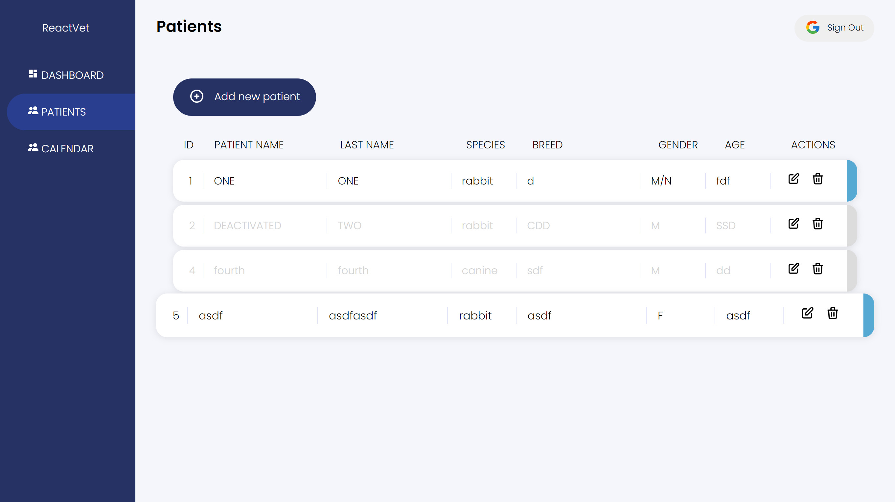

# ReactVet
This is the first iteration of ReactVet, a veterinary clinic management tool that helps organize patient list, scheduling, and health reports. This project is incomplete.

### :hammer_and_wrench: Tools Used
    * Google OAuth Sign In
    * Redux Form
    * Styled-components
    * Redux
    * JSON Webserver